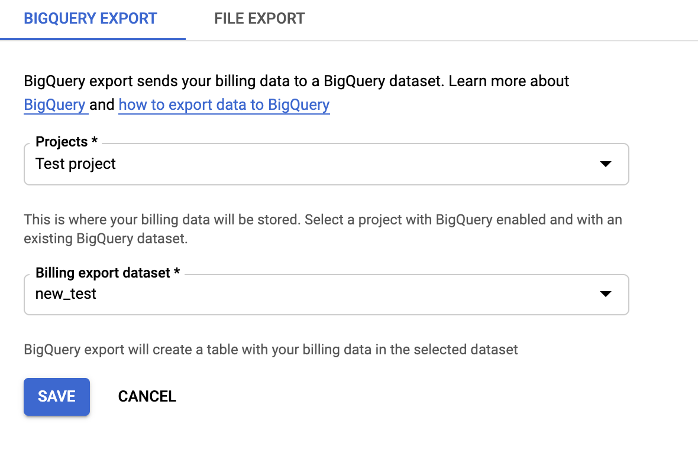
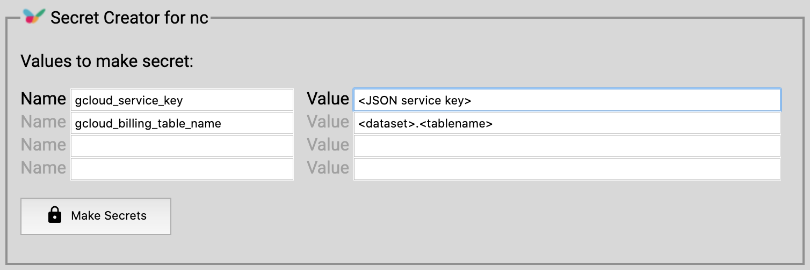

# gcloud

A set of GCloud commands that you can install and run using [Nimbella Commander](https://nimbella.com/resources-commander/overview).

## Installing Google Cloud Commands

This command set requires Nimbella Commander in your Slack workspace.
- [Follow these steps](https://nimbella.com/resources-commander/quickstart#quickstart-guide) to install Nimbella Commander if necessary.
- Then, install the Google Cloud Command set using
```
/nc csm_install gcloud
```

## `gcloudbill` Google Cloud Billing Data

To use the Google Cloud Billing command, you will need to enable the export of billing data from your
Google Cloud projects into BigQuery. The command set [issues](./packages/gcloud/gcloudbilling/index.js) SQL queries
to retried billing data for a specific project, either for an entire month or for a specific date.

```
/nc gcloudbill <project> [<date>]
```

The `date` is formatted as `MM-YYYY` or `MM-DD-YYYY`. For example 7/2020 for July 2020 and 7/20/2020 for July 20th 2020. The project name must be a string that matches the contains only alphanumeric characters plus underscore and dash.

### Step 1. Create BigQuery Dataset

1. Make sure you have the **Billing Account Administrator** role, a project, and a linked billing account.
1. Navigate to the [BigQuery page](https://console.cloud.google.com/bigquery) and make sure your project is selected in the drop-down in the top left.

1. Add a dataset using the button under the resources tab on the left. Fill in the required information 

Now you have a dataset, it can receive the billing details from the various projects in your account.

### Step 2. Connect Cloud Billing to the BigQuery Dataset

1. Access your [Billing Cloud Console](https://console.cloud.google.com/billing/) and choose your Billing Account.
1. Click Billing Export on the left and make sure BigQuery is selected near the top.
1. If your Daily cost detail is disabled, edit the settings and choose your new dataset to export your bills to. 
1. Click "Save". It will some time (more than an hour) before your billing data appears in the BigQuery dataset created in the previous step.

You are almost ready to start sending SQL queries against the billing data through the BigQuery API.

### Step 3. Create BigQuery Service Account

1. [Create a service account key](https://console.cloud.google.com/apis/credentials/serviceaccountkey), with the role of Project > Owner and choose the JSON key type.
1. After clicking "Create", a JSON file will be downloaded to your computer. Open it and copy its contents.
1. From your Slack workspace, run `/nc secret_create`. This command allows you to safely create API secrets that can be shared with Slack slash commands. [Check out the docs to learn more aout secret creation.](https://nimbella.com/resources-commander/guide#secrets)
1. Enter two secrets `gcloud_service_key` which contains the JSON service key, and `gcloud_billing_table_name` for the BigQuery table name you creatd.
1. Now click "Make Secrets" you will see two commands that you need to copy and run in your Slack workspace.

You are now ready to run the `gcloudbill` command.
Here are some way to run the command:
```
# get billing data for a specific project called `test-project`.
/nc gcloudbill test-project

# get billing data for a specific month.
/nc gcloudbill test-project 7/2020

# get billing data for a specific day of the month.
/nc gcloudbill test-project 7/11/2020
```
