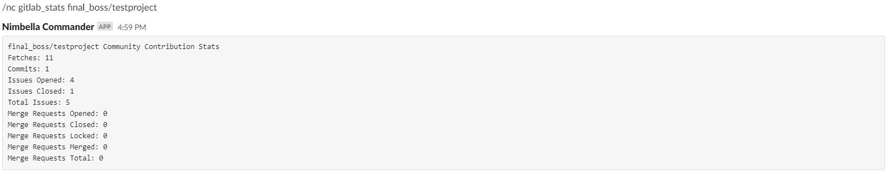
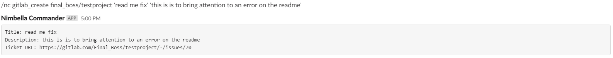
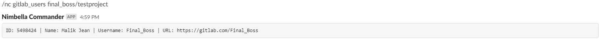

# Nimbella Commander GitLab Command Set
A Nimbella Commander command set for viewing GitLab project statistics, creating tickets, and assigning issues.

## Features
- View community contribution stats for GitLab projects
- Create a ticket for a GitLab project
- Assign issues for a GitLab project
- View list of users in project repository

## Install
```
/nc csm_install gitlab
```

## Requirements
```
In order to use this command set, you must set up a Personal Access Token on GitLab with API access. And save the token as a secret with the key 'gitlabToken'
Use /nc secret_create to create keys
Visit https://docs.gitlab.com/ee/user/profile/personal_access_tokens.html to learn how to setup a Personal Access Token on GitLab
```

## Usage
Viewing community contributions for a GitLab project.
```
/nc gitlab_stats <repo>
```


Creating a ticket for a GitLab project.
```
/nc gitlab_create <repo> <title> <description>
```


Viewing list of users in project repository.
```
/nc gitlab_users <repo> [<name>]
```


Viewing GitLab project issues.
Note: Status may be all, opened, or closed.
```
/nc gitlab_issues
```

Viewing GitLab command set documentation.
```
/nc gitlab
```

Assigning an issue and adding labels.
Note: Use the gitlab_users command to find a team members id to use for the assignee_id.
Use gitlab_issues to find an issue id.
```
/nc gitlab_assign <repo> <issue_id> <assignee_ids> [<labels>]
```
