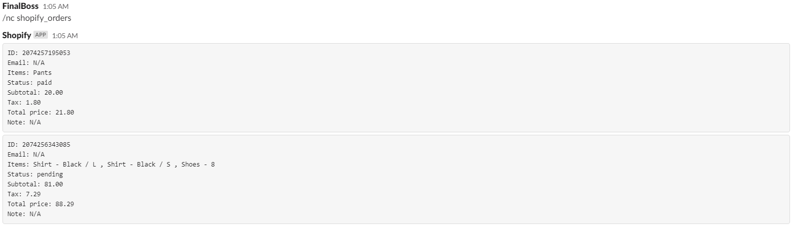
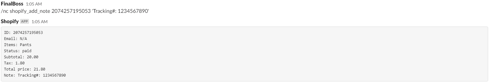
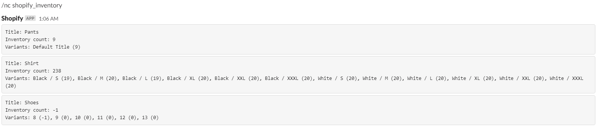

# Nimbella Commander Shopify Command Set
A Nimbella Commander command set for viewing orders, adding notes to orders, getting numbers of products sold,  and getting inventory numbers. 

## Commands
- `orders` - Get a detailed list of orders .
- `add_note <order_id> <note>` - Add a note to an existing order.
- `inventory [<search_words>]` - Get inventory numbers for products.
- `products_sold [<search_terms>]` - Get sale numbers for products in shop.
- `shopify` - View command set documentation

## Install
```
/nc csm_install shopify
```

## Requirements


In order to use this command set, you need to set up an app on Shopify with the following scopes
```
Inventory (Read access)
Orders, transactions and fulfillments (Read and write)
Products, variants and collections (Read)
```
Using /nc secret_create create the following keys
```
Key: shopifyKey / Value: API Key
Key: shopifyPassword / Value: Password
Key: shopifyHostname / Value: Hostname
```

## Usage

View list of past orders
```
/nc shopify_orders
```


Add a note to a past order
NOTE: order_id can be found using /nc shopify_orders
Params: order_id (Unique ID of an order), note (Text to attach to order)
```
/nc shopify_add_note <order_id> <note>
```


View list of products sold
Params: search_terms (Comma deliminated list of text to filter by) EX: "textone, text two, text three four"
```
/nc shopify_products_sold [<search_terms>]
```


View product inventory
Params: search_words (Comma deliminated list of text to filter by) EX: "textone, text two, text three four"
```
/nc shopify_inventory [<search_words>]
```


View command set documentation
```
/nc shopify
```
